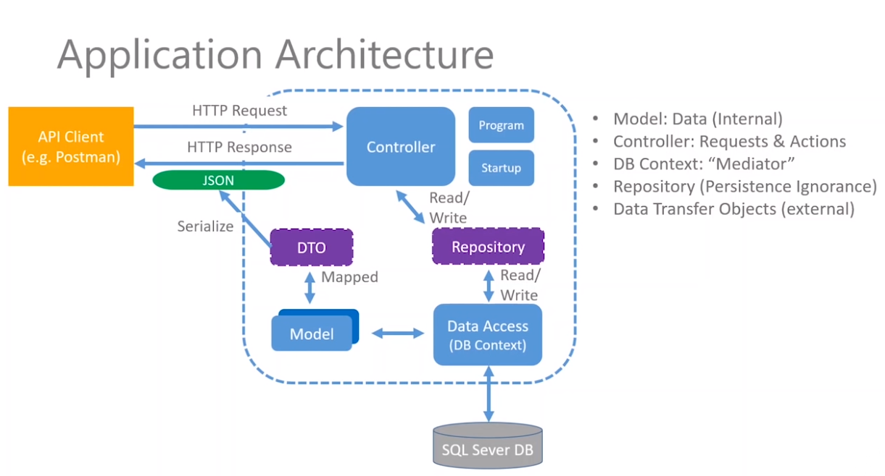

# Commando
With the plethora of CLI commands to learn, it is helpful to have an API which returns us commands that we often forget. (C#, ASP.NET Core, MVC, SQL Server, REST API)
 

<h2>The purpose of this project is to practice concepts related to: </h2>
<ul> 
  <li>Building a REST API</li>
  <li>.NET Core</li>
  <li>MVC Architectural Pattern</li>
  <li>C#</li>
 </ul>
<h3>More specifically, I used the following:</h3>
<ul>
  <li>Dependency injection</li>
  <li>Repository design pattern</li>
  <li>SQL Server Express & SSMS</li>
  <li>Entity Framework Core O/RM (DBContext, Migration)
</li>
  <li>Data Transfer Objects (DTOs) & AutoMapper</li>
  <li>RESTful API guidelines</li>
  <li>HTTP (GET, POST, PUT, PATCH, DELETE, status codes)</li>
  <li>Views (Razor, Shared Layout, ViewBag, RenderSection)</li>
  <li>Testing API Endpoints (SwaggerUI & RESTED)</li>
  
</ul>
<h2> Application Architecture: </h2>

<h2> Website Look: </h2>

<h2> API Endpoints (CRUD): </h2>

<h2>Sample endpoints using Postman:</h2>
<h3>[HttpPost] Creates a new command, returns Location header with link to resource, as well as the '201 Created' status code.
</h3>

